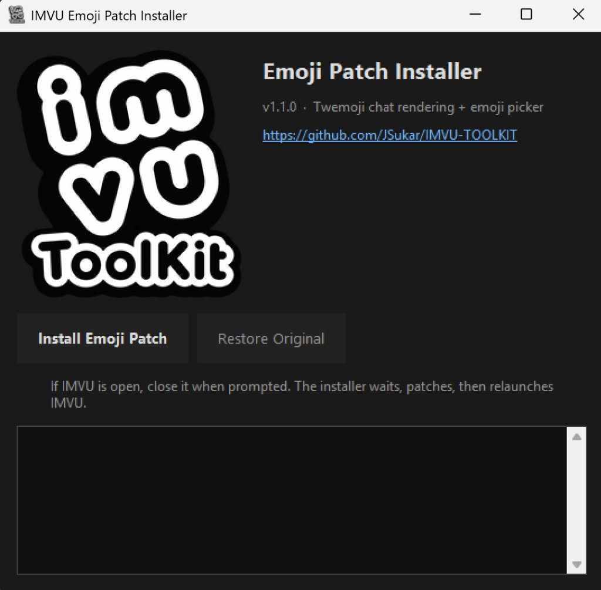
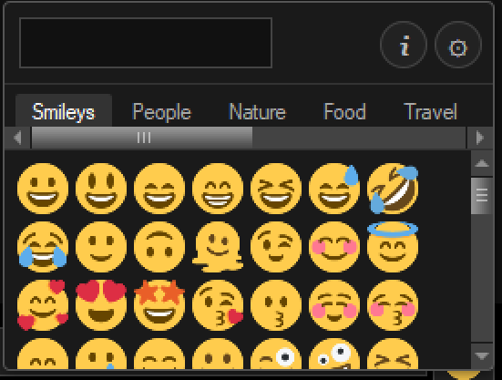
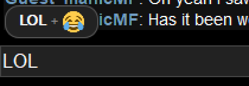
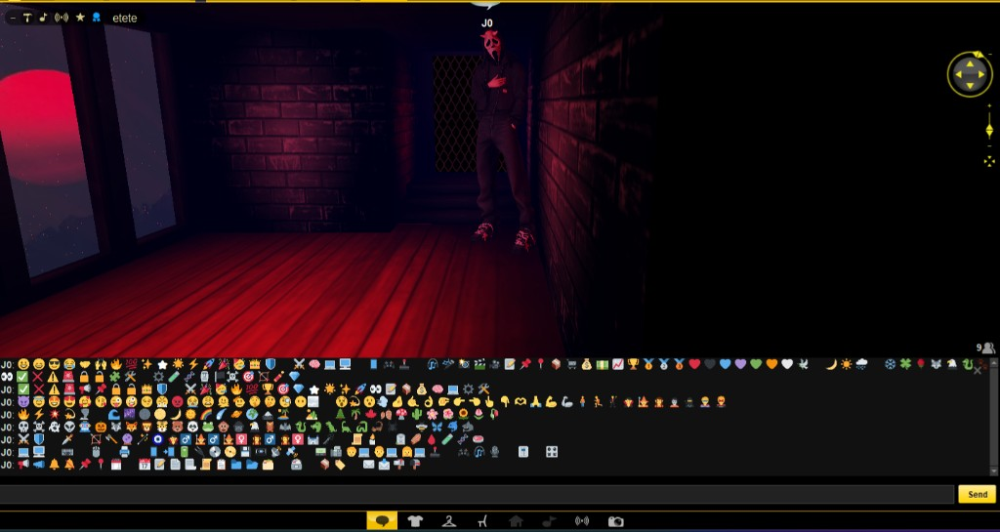

# IMVU Classic Fix Toolkit (Windows)


Fix chat emoji on IMVU Classic’s old Gecko engine, with a searchable picker, text shortcuts, and Twemoji rendering — plus optional DPI scaling patches for high-DPI displays.

**Docs:** [Architecture](docs/architecture.md) · [DPI patches](docs/dpi-patches.md) · [Compatibility](docs/compatibility.md) · [FAQ](docs/FAQ.md)

### Unified CLI

```powershell
python -m imvu_toolkit emoji install
python -m imvu_toolkit emoji restore
python -m imvu_toolkit emoji generate-list
python -m imvu_toolkit tools scale-window --watch
python -m imvu_toolkit dpi clean-layout --restore
```

Legacy root scripts (`patch_imvu_emoji.py`, etc.) still work.

### Development

See [CONTRIBUTING.md](CONTRIBUTING.md).

```powershell
python -m pip install -e ".[dev]"
pytest
ruff check src tests
```

Tag a release (`git tag v1.1.0 && git push origin v1.1.0`) to build and publish `IMVU-Emoji-Installer.exe` via GitHub Actions.

---

## Emoji Fix (Start Here)

IMVU Classic cannot render modern Unicode emoji natively. Missing glyphs show up as hex “tofu” boxes (for example `01FAEA`). This patch fixes chat rendering and adds a full emoji picker next to **Send**.

**Independent of DPI patches** — install emoji support alone.

### Quick start

**Recommended if Windows Defender blocked the old `.exe` — `install.ps1` (Python 3.10+)**

```powershell
git clone https://github.com/JSukar/IMVU-TOOLKIT.git
cd IMVU-TOOLKIT
.\install.ps1
```

Restore: `.\install.ps1 --restore`

**Option A — GUI installer (no Python on target PC)**

1. Download `IMVU-Emoji-Installer.exe` from [Releases](https://github.com/JSukar/IMVU-TOOLKIT/releases).
2. Run it — a window opens with **Install** / **Restore** buttons (if IMVU is open, close it when prompted).
3. Click the smiley button beside **Send** in chat.



**Option B — GUI from source (Python 3.10+)**

```powershell
git clone https://github.com/JSukar/IMVU-TOOLKIT.git
cd IMVU-TOOLKIT
.\install_gui.ps1
```

Restore: `.\install_gui.ps1 --restore`

**Option C — CLI script (Defender-safe, no window)**

```powershell
.\install.ps1
```

**Defender still blocks the `.exe`?** Use `install.ps1` above, or see [FAQ → Defender](docs/FAQ.md#windows-defender-blocks-or-deletes-the-installer).

**Windows SmartScreen:** the installer is unsigned. Click **More info** → **Run anyway**. See [FAQ](docs/FAQ.md).

**Verify before you run:** SHA256 and VirusTotal link for the `.exe` are on each [release page](https://github.com/JSukar/IMVU-TOOLKIT/releases/latest).

Restore: `IMVU-Emoji-Installer.exe --restore` (GUI) or `IMVU-Emoji-Installer.exe --cli --restore` (console)

**Build locally:**

```powershell
.\build_installer.ps1
```

Output: `dist\IMVU-Emoji-Installer.exe`

### Demo (screenshots)

| Picker + search | Shortcuts | Chat rendering |
| --- | --- | --- |
|  |  |  |

Settings (gear) and about (i): [emoji-picker-settings.png](docs/emoji-picker-settings.png) · [emoji-picker-about.png](docs/emoji-picker-about.png)

### Features

- **Search** — filter ~1,880 Unicode 15.1 emojis by keyword
- **Categories** — Smileys, People, Nature, Food, Travel, Activity, Objects, Symbols, Flags
- **Favorites** — ★ button next to **i** opens your list; click ☆ on any emoji to add or remove (saved locally, persists across IMVU restarts)
- **Shortcuts** — type `lol`, `bruh`, `pog`, `:)` , etc.; **Tab** accepts the suggestion (replace word or append emoji — gear icon); 300+ built-in shortcuts
- **Cache** — Twemoji PNGs from jsDelivr, stored in localStorage after first load
- **Restore** — timestamped backups + `--restore`

### How it works

| Layer | Change |
| --- | --- |
| `library.zip` | `im/common.py` — UTF-8 decode with Windows-1252 fallback |
| `imvuContent.jar` | Injects `emoji*.js`, patches chat HTML/JS/CSS |

Details: [Architecture](docs/architecture.md)

### Requirements

- IMVU closed while patching
- Write access to `%APPDATA%\IMVUClient\library.zip` and `ui\chrome\imvuContent.jar`
- Internet on first emoji load per glyph (then cached)

### Troubleshooting (emoji)

See [FAQ](docs/FAQ.md) and the troubleshooting section in [dpi-patches.md](docs/dpi-patches.md#7-troubleshooting-matrix) (emoji entries).

---

## Sharp-DPI Fix (Advanced)

For high-DPI displays (e.g. 250% scale): registry/window helper, runtime probes, and optional reversible patches to `library.zip` / `imvuContent.jar`.

**Start here:** [docs/dpi-patches.md](docs/dpi-patches.md) — includes `fix_imvu_scaling.py`, probe tools, patch runbooks, and troubleshooting.

> DPI patches are separate from emoji. Try Windows-level scaling before internal file patches.

---

## Disclaimer

This project modifies local IMVU client assets. Use at your own risk. Not affiliated with IMVU, Inc.

## License

MIT — see [LICENSE](LICENSE).
