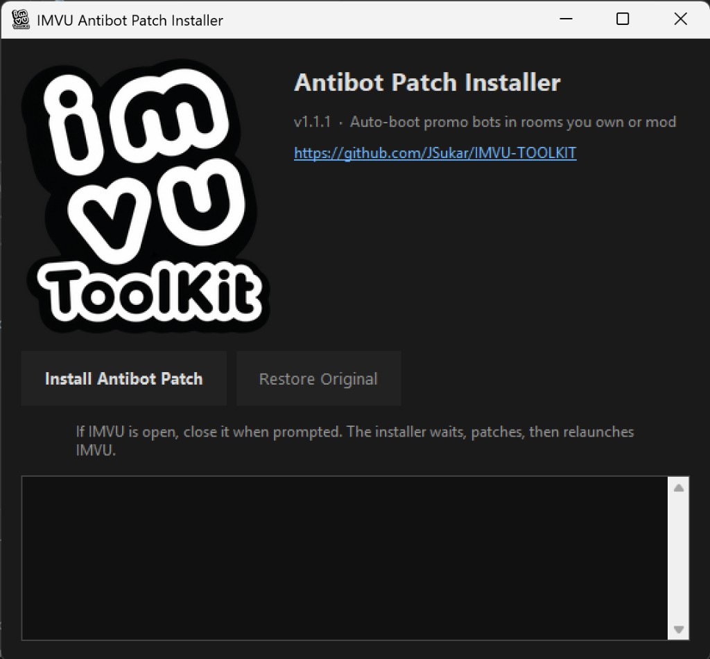
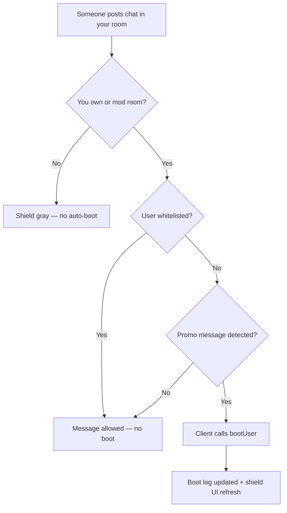
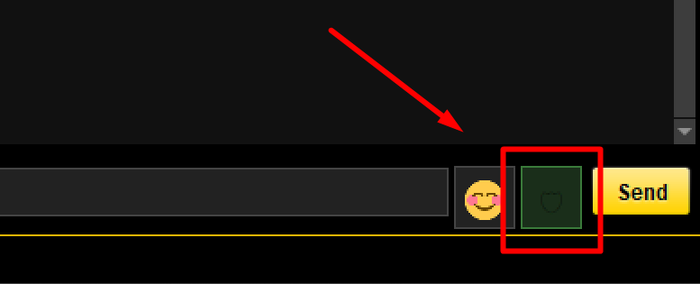
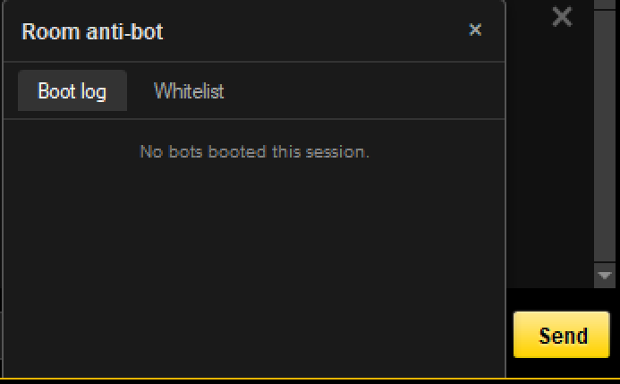
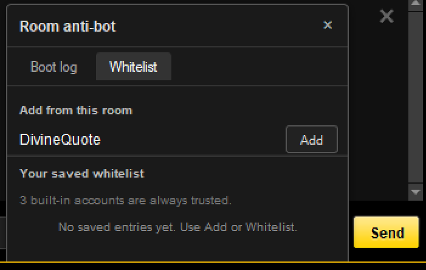
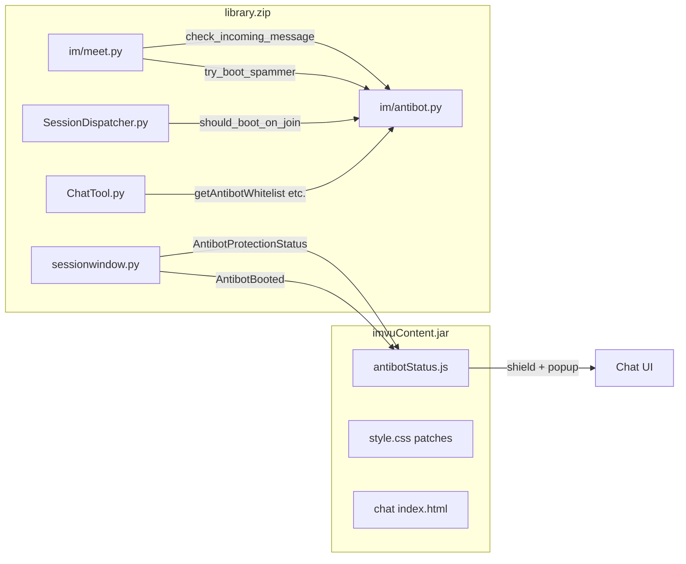
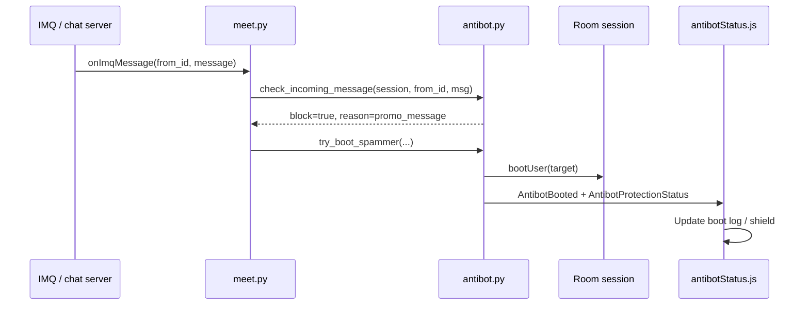
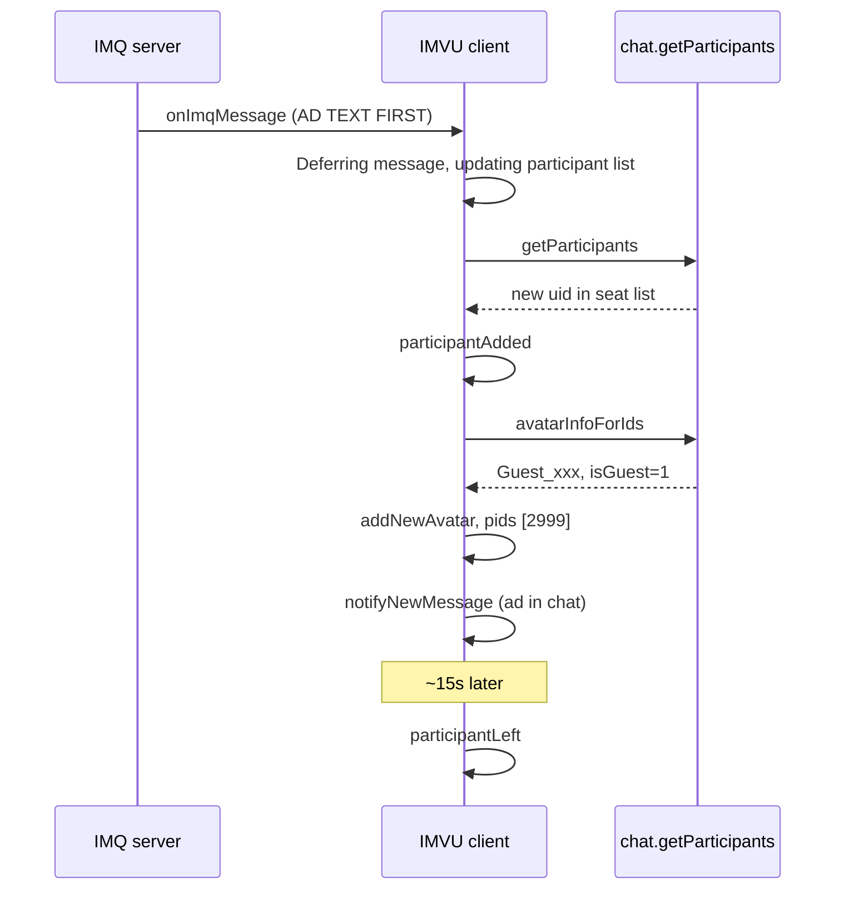
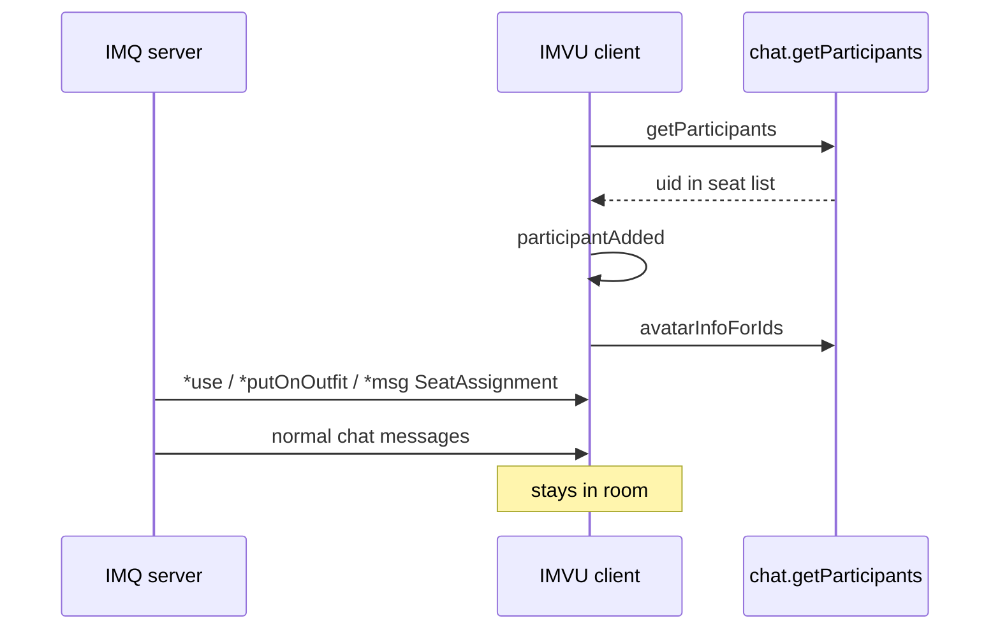

# IMVU VuArchives Spam Bots & Room Antibot — Reference

Research notes on VuArchives promo bots, plus how the **IMVU Toolkit room antibot patch** detects and boots them.

Back to [README](../README.md) | [Architecture](architecture.md) | [FAQ](FAQ.md)

## Contents

1. [Quick start — install the antibot patch](#quick-start--install-the-antibot-patch)
2. [How the antibot works (summary)](#how-the-antibot-works-summary)
3. [In-chat UI (screenshots)](#in-chat-ui-screenshots)
4. [Detection rules](#detection-rules)
5. [Architecture & data flow](#architecture--data-flow)
6. [Whitelist & boot log](#whitelist--boot-log)
7. [Install, restore, and patched files](#install-restore-and-patched-files)
8. [Bot research — log analysis](#bot-research--log-analysis)
9. [Join sequence differences](#join-sequence-differences)
10. [Comparison tables & heuristics](#comparison-tables--heuristics)
11. [Sequence diagrams (bots vs normal users)](#sequence-diagrams)
12. [Open questions](#open-questions--not-yet-observed)

---

## Quick start — install the antibot patch

You must **own the room or have mod/boot privileges** for protection to activate.

| Method | Install | Restore |
|--------|---------|---------|
| GUI `.exe` | `IMVU-Antibot-Installer.exe` | `IMVU-Antibot-Installer.exe --restore` |
| Python GUI | `.\install_antibot_gui.ps1` | `.\install_antibot_gui.ps1 --restore` |
| Python CLI | `python -m imvu_toolkit antibot install --relaunch-imvu` | `python -m imvu_toolkit antibot restore --relaunch-imvu` |
| No `.exe` (Defender) | `.\install_antibot.ps1` | `.\install_antibot.ps1 --restore` |

Close IMVU when prompted; the installer waits, patches, then relaunches.



---

## How the antibot works (summary)



**What it does**

- Hooks IMVU's chat pipeline (`meet.py`) and boots users who post **known VuArchives promo text**.
- Shows a **shield icon** beside Send: green **ON** when you can boot in this room, gray when inactive.
- Click the shield for **Boot log** (session) and **Whitelist** (persistent).

**What it does not do**

- Does **not** boot on join for `Guest_*` names (too many false positives on real guests).
- Does **not** flag generic words like `vu`, `discord`, or `archives` alone.
- Does **not** flag bare `discord.com/invite` or `discord.gg/` links without VuArchives markers.
- Does **not** run on rooms where you lack boot privileges (visiting someone else's room).

---

## In-chat UI (screenshots)

### Shield (protection active)

When you own or mod the room, the shield turns green with an **ON** label:



### Boot log tab

Lists everyone booted **this session**, with reason and a **Whitelist** button per entry. Paginated (10 per page) when the list is long.



### Whitelist tab

- **Add from this room** — quick **Add** buttons for people currently in chat (not already trusted).
- **Your saved whitelist** — entries you saved; **Remove** to undo. Built-in trusted IDs are always on and not listed as removable rows.



---

## Detection rules

Detection lives in `library_decompiled_structured/im/antibot.py` and runs **only when you have mod boot power**.

### Message normalization

Before matching, text is lowercased and scrubbed of:

- **Zero-width characters** (U+200B, U+200C, U+200D, U+FEFF, U+2060)
- **Homoglyphs** (Cyrillic/Greek/Armenian lookalikes → ASCII, e.g. `vuɑrϲhives.ϲοm` → `vuarchives.com`)

### Triggers a boot (`promo_message`)

Any of these in normalized message text:

| Marker | Example |
|--------|---------|
| `vuarchives.com` | Plain or homoglyph URL |
| `vuarchives` | Brand as one word |
| `h87ftaz6v8` | Discord invite code (recent campaign) |
| `sdkpd4knjd` | Discord invite code (older campaign) |

### Explicitly does **not** trigger

| Pattern | Why skipped |
|---------|-------------|
| `Guest_<name>` on join | Real guests false-positive |
| Word `vu` + `archives` separately | Normal chat ("vu archives", room names) |
| `discord` + `invite` without campaign codes | Generic Discord links |
| `discord.com/invite`, `discord.gg/` alone | Not VuArchives-specific |

### Boot prerequisites

All must be true:

1. Room session with `hasBootPrivileges` for your user
2. `session.canBoot(you, target)` allows it
3. Target not whitelisted (built-in or saved)
4. Target not already booted this client session
5. Promo message detected (or legacy join hook if re-enabled)

---

## Architecture & data flow

### Patched components



| Layer | File | Role |
|-------|------|------|
| Detection | `im/antibot.py` | Promo match, whitelist, boot, session log |
| Message hook | `im/meet.py` | Intercepts incoming chat before display; boots on promo |
| Join hook | `imvu/session/SessionDispatcher.py` | Join-time check (currently always `False`) |
| UI bridge | `imvu/client/sessionwindow.py` | Fires Gecko events for shield/popup |
| Gecko API | `imvu/tool/ChatTool.py` | `getAntibotWhitelist`, add/remove, protection status |
| Frontend | `js/antibotStatus.js` | Shield button, boot log, whitelist tabs |
| Styles | `tool/chat/style.css`, `tool/newchat/style.css` | Popup layout, tabs, pager |

### Boot sequence (when promo is posted)



### Persistence

| Data | Location | Lifetime |
|------|----------|----------|
| Whitelist | `%APPDATA%\IMVUClient\antibot_whitelist.json` | Permanent across sessions |
| Boot log | In-memory per room session | Cleared when you leave the room |
| Patch backups | `library.zip.bak-antibot-*`, `imvuContent.jar.bak-antibot-*` | Until restore or manual delete |

**Built-in whitelist IDs** (always trusted, not removable in UI): `99815795`, `386805690`, `53421654`.

---

## Whitelist & boot log

**Whitelist someone**

- Boot log → **Whitelist** on a booted user, or
- Whitelist tab → **Add** next to a room participant, or
- CLI/API: `addAntibotWhitelistUser`

**Remove from whitelist**

- Whitelist tab → **Remove** on a saved entry (not built-ins).

**Boot log**

- Resets each time you leave and re-enter a room session.
- Shows avatar name, reason (`Promo / spam message`), and whitelist actions.

---

## Install, restore, and patched files

**Build installers locally**

```powershell
.\build_installer.ps1
```

Produces `dist\IMVU-Emoji-Installer.exe` and `dist\IMVU-Antibot-Installer.exe`. CI/release publish both on tagged releases.

**Restore** copies the newest `.bak-antibot-*` backup over live `library.zip` and `imvuContent.jar`.

**Logs after boot**

```
IMVU antibot: booted user 390288917 ('promo_message')
```

in `%APPDATA%\IMVU\IMVULog.log` (via `im.antibot` logger).

---

# Bot research — log analysis

Analysis based on classic IMVU client logs (`IMVULog.log*`) from:

- Live client: `%APPDATA%\IMVU\`
- Archived copies: `IMVU/`, `Logstoreverse/` in this repo

Observed viewer account: `userId` **21517672**

---

## Summary

VuArchives promo bots are **hit-and-run guest accounts**. They enter rooms, post one canned advertisement, and leave within ~15 seconds. Normal users join with outfit/seat protocol traffic, send real chat, and remain in the room.

Two link campaigns were observed:

| Campaign | Discord | URL style |
|----------|---------|-----------|
| Recent | `discord.com/invite/h87FtAz6V8` | Homoglyphs (`vuɑrϲhives.ϲοm`) or zero-width spaced (`v​u​a​r​c​h​i​v​e​s​.​c​o​m`) |
| Older (~May 2026) | `discord.gg/sDKpD4knJd` | Plain `vuarchives.com/join` |

---

## Log Sources and Events

### Live logs (`AppData\Roaming\IMVU`)

| File | Ad events | Campaign |
|------|-----------|----------|
| `IMVULog.log` | 3 | `h87FtAz6V8` |
| `IMVULog.log.5` | 2 | `h87FtAz6V8` |
| `IMVULog.log.4` | 0 | — |

### Repo archived logs

| File | Ad events | Campaign |
|------|-----------|----------|
| `IMVU\IMVULog.log.2` | 7 | `sDKpD4knJd` |

### Documented spam bot accounts

| Display name | User ID | Chat ID | Log file | Local time (approx) | Dwell |
|--------------|---------|---------|----------|---------------------|-------|
| Guest_deltasurge62 | 390288721 | 367846772 | `IMVULog.log` L531 | 2026-06-10 00:32:31 | ~15s |
| Guest_betastorm93 | 390288917 | 394593092 | `IMVULog.log` L2667 | 2026-06-10 00:36:50 | ~15s |
| (unknown) | 390292635 | 386666864 | `IMVULog.log` L2883 | — | ignored (never joined) |
| Guest_louisas5055 | 390301483 | 367846772 | `IMVULog.log.5` L260 | 2026-06-07 16:30:28 | ~15s |
| Guest_daystar5464 | 390301099 | 367242394 | `IMVULog.log.5` L2643 | 2026-06-07 16:43:33 | ~15s |
| Guest_mhagenes4 | 390308771 | 341256288 | `IMVU\IMVULog.log.2` | 2026-05-23 23:41:52 | ~14s |
| Guest_daylotus | 390308778 | 341256288 | `IMVU\IMVULog.log.2` | — | ~15s |
| Guest_raulayla07 | 390308798 | 341256288 | `IMVU\IMVULog.log.2` | — | — |
| Guest_douglascoy01 | 390308787 | 341256288 | `IMVU\IMVULog.log.2` | — | — |
| (ignored) | 390308788, 390308784 | 341256288 | `IMVU\IMVULog.log.2` | — | never joined |

---

## Join sequence differences {#join-sequence-differences}

### Spam bot (typical — Pattern A: message leads join)

Most common in recent logs (`betastorm93`, `deltasurge62`, `daylotus`, `louisas5055`):

1. `onImqMessage` — **ad text arrives first**
2. `Deferring message … updating participant list`
3. `chat.getParticipants` — new UID appears in seat list
4. `participantAdded called for <uid>`
5. `test.avatarInfoForIds` — returns guest name, `isGuest=1`
6. `addNewAvatar` — seat assigned
7. `__usePidsOnAvatar` — outfit `[2999]` only
8. `NEW PARTICIPANT` UI event — `Guest_<name>`
9. `notifyNewMessage` — ad shown in chat UI
10. ~15s later: `notifyParticipantRemoved` / `participantLeft`

**Example timing (Guest_betastorm93, chat 394593092):**

| Step | Log timestamp | Delta |
|------|---------------|-------|
| Ad IMQ | 7986.849 | — |
| participantAdded | 7987.044 | +0.195s |
| Avatar spawned | 7987.322 | +0.473s |
| Ad in UI | 7987.338 | +0.489s |
| Left room | 8002.046 | +15.0s |

### Spam bot (Pattern B: join leads message)

Seen in older `IMVULog.log.2` (`Guest_mhagenes4`):

1. `participantAdded` / avatar spawn first
2. Ad `onImqMessage` ~0.8s later
3. Same ~15s exit

Both patterns share the same post-join profile: default outfit, one ad, quick leave.

### Normal user (typical)

1. `chat.getParticipants` — user already in list, or appears without ad deferral
2. `participantAdded`
3. `avatarInfoForIds`
4. Protocol/sync messages: `*use`, `*putOnOutfit`, `*msg SeatAssignment`, `*seat`, `*imvu:isPureUser`
5. Optional: `*msg BeginText` / `*msg EraseText` (typing)
6. Real chat text (conversation, not promo)
7. **Stays in room** — no ~15s auto-leave

**Example: regular occupant `38218080` in chat `394593092`**

- Already present when log segment starts
- Sends `*use` with **21 outfit PIDs**
- Sends `*msg SeatAssignment`
- Sends normal chat: `"youd have to band guest "`, `"hmm... "`
- Remains in room across entire log window

**Example: dressed regular `390257138` in chat `367846772`**

First messages after appearing:

```
*imvu:isPureUser
*msg SeatAssignment 3 390257138 4 17901
*putOnOutfit 74588469 33991555 … (23 items)
```

Repeats while staying in room — outfit/seat sync, not promo.

---

## Comparison tables & heuristics {#comparison-tables--heuristics}

### Side-by-side comparison table

| Signal | Spam bots | Normal users |
|--------|-----------|--------------|
| First IMQ after appearing | Promo ad (emoji + URL + Discord invite) | `*use`, `*putOnOutfit`, `*msg SeatAssignment`, `*seat`, typing |
| Message before avatar rendered | Often yes | No — join/sync first, chat later |
| Client log: defer line | `Deferring message … updating participant list` | Unusual; normal joins use `participantAdded` without defer |
| Outfit PIDs | Always `[2999]` (default guest mesh) | Many PIDs (10–23+ items typical) |
| Stay duration | ~14–15 seconds, then `participantLeft` | Minutes to hours |
| Chat content | Single canned advertisement | Conversation, actions, room state |
| Messages ignored | Some ads dropped: `Ignoring message … because user is not in chat` | Rare for legitimate joins |
| Account type | `isGuest=1`, disposable `Guest_*` names | Mix of guests and registered; stable UIDs |
| User ID range (observed bots) | `390288xxx`, `390301xxx`, `390308xxx` | Stable IDs e.g. `38218080`, `53421654`, `341252675` |
| Seat assignment | Often high or arbitrary seats (e.g. seat 17) | Consistent seat sync via `*msg SeatAssignment` |
| Avatar card / interaction | Minimal; quick exit | May open avatar cards, ongoing IMQ traffic |
| URL evasion | Homoglyphs (`vuɑrϲhives.ϲοm`) or zero-width chars | N/A |
| Campaign rotation | Two Discord invites observed across log history | N/A |

---

## Message Content Differences

### Spam bot messages (examples)

- Independent VU/IMVU companion platform for historical browsing → vuɑrϲhives.ϲοm/join | discord.com/invite/h87FtAz6V8
- Can't find an old room or outfit? Historical tools can help → vuɑrϲhives.ϲοm/join | discord.com/invite/h87FtAz6V8
- Try searching for past room activity or avatar changes → …
- Search historical room data, outfits, and profiles → zero-width spaced vuarchives.com/join | …
- Everything leaves a trace… VuArchives knows → vuarchives.com/join + discord.gg/sDKpD4knJd *(older campaign)*
### Normal user messages (examples from same sessions)

- `"youd have to band guest "`
- `"hmm... "`
- `"i don't plan on it, i'm not on much!"`
- `"Me and Divi were just talking about imvu shit about bots"`
- Protocol: `*use …`, `*msg SeatAssignment …`, `*seat 1`, `*putOnOutfit …`

---

## Avatar / Profile Differences

| Field | Spam bots | Normal users |
|-------|-----------|--------------|
| `isGuest` | Always `1` in observed bots | `0` or `1` |
| `avatarName` | Random `Guest_<word><digits>` | Real or guest names; often reused across sessions |
| Default avpic | Shared across bots (same image hash for multiple accounts) | Usually unique per user |
| Shared avpic hashes (observed) | `c6a185fa…` (betastorm93, mhagenes4); `ee00fd0e5` (louisas5055, daystar5464) | — |
| Outfit definition | `[2999]` only | Multi-item outfits |
| Age / DOB | Plausible but disposable (e.g. age 20, DOB 2006-01-11) | Plausible, not indicative alone |

---

## Client Log Line Differences

### Lines seen for spam bots

```
meet.pyo INFO: onImqMessage(['390288917', u'/chat/394593092', u'messages', '{"message":"…vuarchives…"}'])
meet.pyo INFO: Deferring message {…'message': u'…promo…'…}, updating participant list
SessionDispatcher.pyo INFO: participantAdded called for 390288917
LoggingServerProxy.pyo INFO: <-- test.avatarInfoForIds([390288917]) returned […, 'betastorm93', 1, …]
sessionwindow.pyo INFO: addNewAvatar(): definition=[2999] userId=390288917 seat=(1, 0)
sessionwindow.pyo INFO: __usePidsOnAvatar(): pids: [2999]
StandardGeckoListener.pyo INFO: NEW PARTICIPANT: {"who":"Guest_betastorm93","userId":390288917,…}
SessionDispatcher.pyo INFO: notifyNewMessage called for 390288917/u'…promo…'/1781066210.291
meet.pyo INFO: notifyParticipantRemoved(): userId: 390288917
SessionDispatcher.pyo INFO: participantLeft called for 390288917
```

### Lines seen for ignored spam (bot never fully joined)

```
meet.pyo WARNING: Ignoring message {…'from_id': 390292635…} because user is not in chat
```

### Lines seen for normal users

```
SessionDispatcher.pyo INFO: participantAdded called for 341252675
sessionwindow.pyo INFO: __usePidsOnAvatar(): pids: [55752464, 70943009, …]  (many PIDs)
sessionwindow.pyo INFO: action_msgImpl(): command: u'*msg' params: u'SeatAssignment …'
notifyNewMessage called for 38218080/u'youd have to band guest '
```

---

## Behavioral Heuristics (for detection)

### Research heuristics (offline log analysis)

A participant is **likely a VuArchives spam bot** if several of these are true:

1. Guest account (`isGuest=1`) with UID in `39028xxxx`–`39030xxxx` range
2. First visible message is a promo containing `vuarchives`, homoglyph URL, or known Discord invites (`h87FtAz6V8`, `sDKpD4knJd`)
3. Outfit is exactly PID `[2999]`
4. `Deferring message … updating participant list` precedes or accompanies first message
5. Leaves within ~15 seconds of join
6. No `*use`, `*putOnOutfit`, or `*msg SeatAssignment` before the ad
7. Shares default avpic hash with other known bot accounts

A participant is **likely normal** if:

1. Join traffic is protocol messages (`*use`, `*putOnOutfit`, `*msg SeatAssignment`) before conversational chat
2. Outfit has many PIDs
3. Sends multiple non-promo messages over time
4. Remains in room beyond ~30 seconds
5. Participates in room state (`*seat`, `*imvu:setRoomState`, typing indicators)

### What the live antibot patch actually uses

The installed patch does **not** use outfit PIDs, dwell time, or guest UID ranges. It only boots on **promo message content** (see [Detection rules](#detection-rules)) when you have boot privileges. Research heuristics above informed what to avoid (e.g. join-time guest booting) and which URL markers to keep.

---

## Rooms Hit (observed)

| Chat ID | Spam hits | Notes |
|---------|-----------|-------|
| 367846772 | 3+ | Repeated target across sessions |
| 394593092 | 1 | betastorm93 |
| 386666864 | 1 | ignored (not in chat) |
| 367242394 | 1+ | daystar5464; also normal chat |
| 341256288 | 7 | older campaign cluster |

---

## Sequence Diagrams {#sequence-diagrams}

### Spam bot (Pattern A)



### Normal user



---

## Raw Log Paths

| Purpose | Path |
|---------|------|
| Live client logs | `C:\Users\Null\AppData\Roaming\IMVU\IMVULog.log*` |
| Repo archive | `imvurep\IMVU\IMVULog.log*` |
| Repo archive | `imvurep\Logstoreverse\IMVULog.log*` |

Key log functions involved:

- `meet.pyo` — `onImqMessage`, `notifyParticipantRemoved`
- `SessionDispatcher.pyo` — `participantAdded`, `participantLeft`, `notifyNewMessage`
- `sessionwindow.pyo` — `addNewAvatar`, `__usePidsOnAvatar`
- `LoggingServerProxy.pyo` — `chat.getParticipants`, `test.avatarInfoForIds`

---

## Open Questions / Not Yet Observed

- Whether bots ever send `*imvu:isPureUser` before ads (normal guests sometimes do)
- Full leave timing for every archived bot in `IMVULog.log.2`
- Whether blocking guest chat would stop ad delivery before `notifyNewMessage`
- Server-side origin of IMQ message-before-join ordering

---

*Bot research: log analysis session 2026-06-10. Antibot patch docs updated 2026-06-11. Re-run grep/analysis on fresh `IMVULog.log` after new incidents to extend the bot list.*

