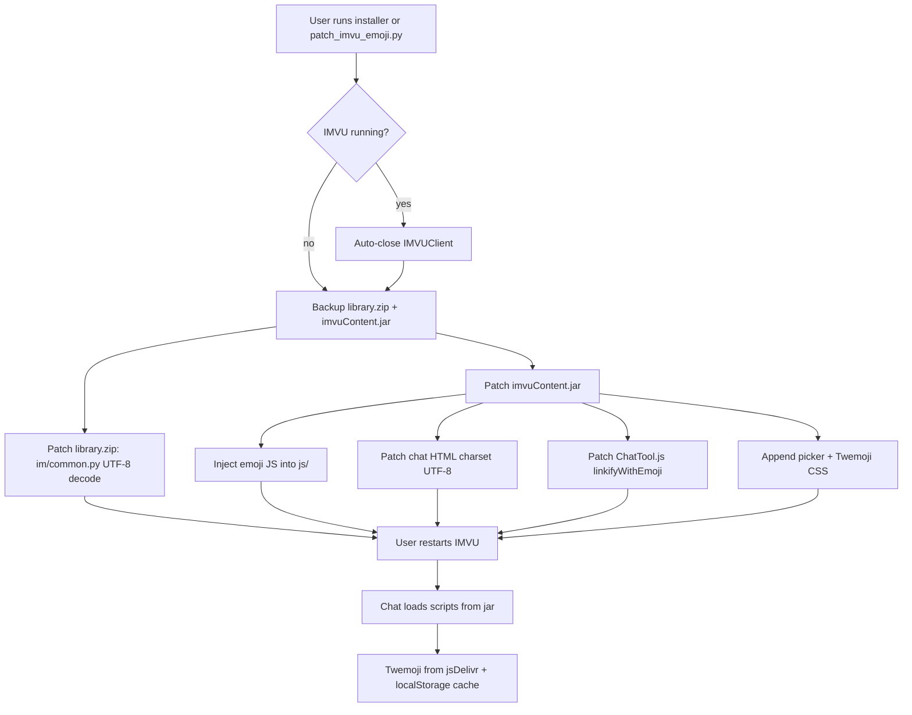

# Architecture

How the IMVU Classic Fix Toolkit patches the client without modifying the `.exe`.

Back to [README](../README.md) | [DPI patches](dpi-patches.md) | [Compatibility](compatibility.md) | [FAQ](FAQ.md)

## IMVU Classic layout (relevant paths)

```
%APPDATA%\IMVUClient\
├── IMVUClient.exe          # main process (not patched)
├── library.zip             # Python runtime + IMVU logic (patched for emoji + some DPI)
└── ui\chrome\
    └── imvuContent.jar     # Gecko UI assets (patched for emoji + some DPI)
```

## Emoji patch flow



### Layers

| Layer | File | Change |
| --- | --- | --- |
| Message bytes | `library.zip` → `im/common.py` | Decode UTF-8 first, Windows-1252 fallback |
| Script bundle | `imvuContent.jar` → `js/emoji*.js` | Picker, catalog, shortcuts, cache |
| Chat UI | `tool/chat/*`, `tool/newchat/*` | UTF-8 meta, script tags, CSS |
| Runtime | In-chat Gecko | Twemoji `` via `emojiDisplay.js` |

### Safety

- Patch markers in source/CSS/JS detect already-patched files.
- Timestamped backups: `*.bak-emoji-YYYYMMDD-HHMMSS`.
- `--restore` copies the newest matching backup over the live file.

## DPI patch flow (overview)

DPI fixes target **coordinate mismatch** between Win32, Gecko, and the 3D scene on high-DPI monitors. See [dpi-patches.md](dpi-patches.md) for the full runbook.

1. **Windows-level** — `fix_imvu_scaling.py` sets `~ DPIUNAWARE` (no file changes).
2. **Layout** — `patch_imvu_clean_dpi_layout.py` rebuilds `library.zip` Gecko compensation.
3. **Targeted** — hitboxes, click remap, dialog scale, white-line seam (jar/zip).

Each family has its own backup suffix and restore path.

## Package layout (this repo)

```
src/imvu_toolkit/
  paths.py              # project root + asset paths (PyInstaller-aware)
  imvu_process.py       # detect / close IMVUClient
  zip_utils.py          # safe zip/jar rewrite + restore
  patches/emoji/        # emoji constants, transforms, apply/restore
  patches/dpi/          # DPI script registry
  tools/runner.py       # launch scripts/ utilities
patches/dpi/            # DPI patch scripts (legacy layout, cwd-relative paths)
emoji_assets/js/        # injected chat JavaScript
scripts/                # probes, emoji catalog generator, scaling helper
```

Root-level `patch_imvu_*.py` files are thin wrappers for backward compatibility.

## CI / releases

- **CI** — Ruff + pytest on Ubuntu; Windows build artifact on push to `master`.
- **Release** — Git tag `v*` triggers installer build + GitHub Release with `CHANGELOG` body.
